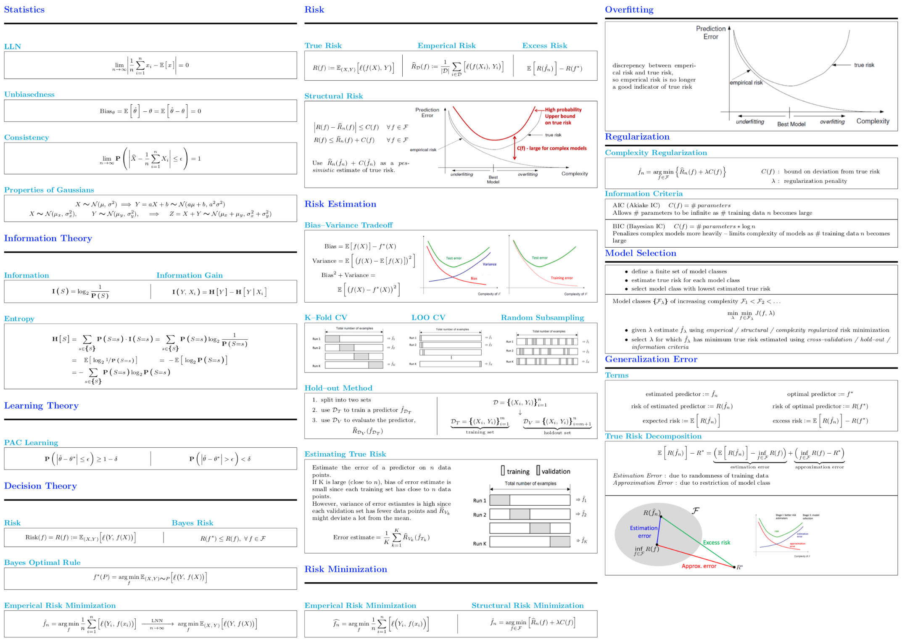
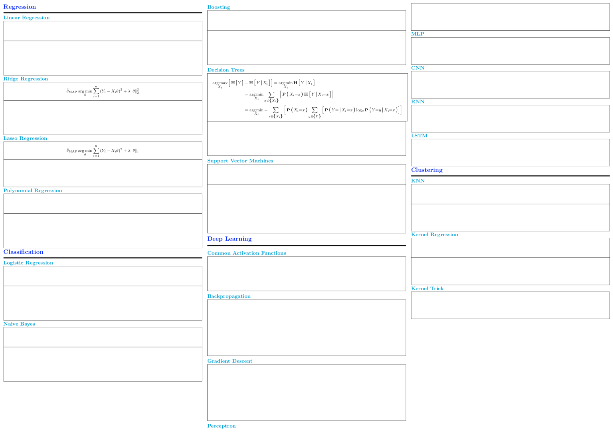

## Overview

Exams for Carnegie Mellon University's Introduction to Machine Learning (specifically the 700-level variant) are not often closed-book, instead often allowing for a single page of notes if not being fully open-book.

Additionally there is a significant amount of heterogenous material covered in the course, and it is not possible (nor useful) to include all of it on one page (front and back). Personally, I find it easier to recall information given a stimulus either drawn from or associated with the material in question. To this end, this cheatsheet was to be a well categorized collection snippets drawn from course material.

However, I took the course having previously completed the 600-level offering. And found that the majority of new content that I had not yet fully internalized as knowledge came from learning theory. As such I dedicated the the majority of the page front to material relevant to learning theory.

If you decide to use this cheatsheet, I suggest that you refactor it for yourself. At the very least it should be useful as an example.

## Preview

### Front



### Back



## Download
If you just want the pdf without the hassle of re-compiling the source. Here you go:
[Dropbox Link](https://www.dropbox.com/s/ntjnj9szjvyqos3/10-701-cheatsheet.pdf)

## Compiling

The source uses several custom commands defined in [macros.tex](https://github.com/jakeparker/latex/tree/master/macros/macros.tex).

<details><summary markdown="span"><code>list of commands</code></summary>

* `\abs{...}` - `\lvert ... \rvert` (|...|)
* `\infinity` - `\infty` (∞)

```latex
\DeclarePairedDelimiter{\verts}{\lvert}{\rvert}
\newcommand{\abs}[1]{\verts*{#1}}

\newcommand{\infinity}{\infty}
\newcommand{\posinf}{\mathord{{+}\infty}}
\newcommand{\neginf}{\mathord{{-}\infty}}
```

* `\Exp{...}` - `\mathbb{E} [...]`
* `\Prob{...}` - `\mathbf{P} (...)`
* `\given` - `\mid` (|)
* `\by` -  `\colon` (;)
* `\as` - `\sim` (~)

```latex
\DeclareMathOperator{\expectation}{\mathbb{E}}
\newcommand{\Exp}[1]{\expectation \mathord{\mathlarger{\mleft\lbrack\vphantom{#1}\mright.}} #1 \mathord{\mathlarger{\mleft.\vphantom{#1}\mright\rbrack}}}

\DeclareMathOperator{\probability}{\mathbf{P}}
\newcommand{\Prob}[1]{\probability \bm{\mathord{\mathlarger{\mleft\lparen\vphantom{#1}\mright.}}} #1 \bm{\mathord{\mathlarger{\mleft.\vphantom{#1}\mright\rparen}}}}

\newcommand{\given}{\bm{\mathord{\mathlarger{\left. \middle\vert \right.}}}}

\newcommand{\by}{\bm{\mathord{\mathlarger{;}}}\ }

\newcommand{\as}{\bm{\mathrel{\mathlarger{\sim}}}}
```

* `\estimate{...}` - `\hat{...}`
* `\optimal{...}` - `{...}^{\ast}`

```latex
\newcommand{\estimate}[1]{\hat{#1}}

\newcommand{\optimal}[1]{#1^{\ast}} % \varhexstar
```

* `\argmin` - `\arg \min`
* `\argmax` - `\arg \max`
* `\map` - `\mathrm{MAP}`
* `\loss` - `\ell`
* `\risk` - `R`

```latex
\DeclareMathOperator*{\argmax}{\arg\max}

\DeclareMathOperator*{\argmin}{\arg\min}

\newcommand{\map}{\mathrm{MAP}}

\newcommand{\loss}{\mathord{\raisebox{-0.3ex}{$\mathlarger{\mathlarger{\ell}}$}}}

\newcommand{\risk}{R}
```

* `\Information{...}` - `I[...]`
* `\Entropy{...}` - `H[...]`

```latex
\DeclareMathOperator{\information}{\mathbf{I}}
\newcommand{\Information}[1]{\information \bm{\mathord{\mathlarger{\mleft\lparen\vphantom{#1}\mright.}}} #1 \bm{\mathord{\mathlarger{\mleft.\vphantom{#1}\mright\rparen}}}}

\DeclareMathOperator{\entropy}{\mathbf{H}}
\newcommand{\Entropy}[1]{\entropy \bm{\mathord{\mathlarger{\mleft\lbrack\vphantom{#1}\mright.}}} #1 \bm{\mathord{\mathlarger{\mleft.\vphantom{#1}\mright\rbrack}}}}
```

</details>


If you want to compile the cheatsheet from source you will need to either download [macros.tex](https://github.com/jakeparker/latex/tree/master/macros/macros.tex) and in [cheatsheet.tex](https://github.com/jakeparker/10-701-cheatsheet/blob/master/cheatsheet.tex) change `\usepackage{macros}` to `\include{macros}`, or install my collection of [latex packages](https://github.com/jakeparker/latex/tree/master/).

Note: I use [luatex](http://www.luatex.org), but LaTeX _should_ work too. If you don't have LaTeX installed, I'd suggest using either [mactex](http://www.tug.org/mactex/) (mac) or [texlive](https://www.tug.org/texlive/) (windows).
